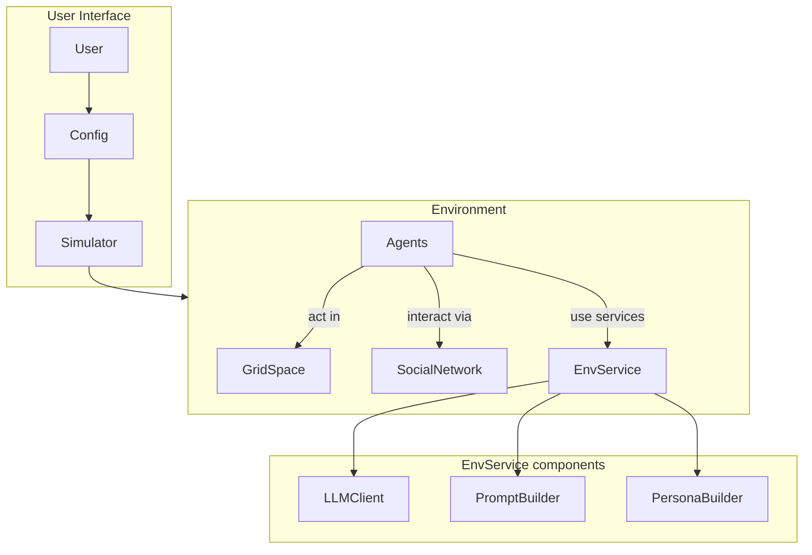

[](https://github.com/psf/black)

<p align="center">
  
  
</p>


EconSimulacra is a simulation platform for studying complex socio-economic systems with large language model (LLM) agents. The framework enables researchers and practitioners to simulate:

- household consumption
- firm pricing strategies
- narrative diffusion through social networks
- spatial mobility of agents

By combining agent-based modeling with LLM reasoning, EconSimulacra allows researchers to study emergent macroeconomic phenomena from micro-level behavioral rules.

# Key Features

- 🧠 LLM-driven agents with internal states and reasoning
- 🏙 Spatial grid environments with agent mobility
- 🛒 Market interactions (consumption, pricing)
- 🌐 Social network dynamics (follow, unfollow, narrative diffusion)
- 📊 Structured simulation logs for analysis
- ⚡ Parallel simulation execution
- 🧩 Modular architecture for extensibility

# Conceptual Architecture

EconSimulacra consists of the following main components:



## [**Simulator**](https://github.com/SimulacraBusiness/econsimulacra/blob/main/src/econsimulacra/simulator.py) 

The **Simulator** executes the simulation, manages temporal progression, and supports parallel execution. At each simulation step, the simulator collects actions from all agents based on their observations and applies them to the environment. The core logic of the simulator is conceptually as follows.

```python
num_steps: int
all_actions_dic = {}
for _ in range(num_steps):
    for agent_id in env.agent_ids:
        agent = self.env.agent_id2agent[agent_id]
        obs = self.env.get_observations(agent_id=agent_id)
        action_dic = agent.act(obs)
        all_actions_dic[agent_id] = action_dic
    self.env.step(all_actions_dic)
```

In each step:
1. The environment provides observations to each agent ```env.get_observations(agent_id=agent_id)```
2. Agents decide their actions based on these observations ```action_dic = agent.act(obs)```
3. The environment updates the global state according to the agents' actions. ```env.step(all_actions_dic)```

## [**Environment**](https://github.com/SimulacraBusiness/econsimulacra/blob/main/src/econsimulacra/envs/base.py)

The **Environment** manages the global state of the simulated world, including the internal states of all agents. It is responsible for:

- providing observations to agents (```.get_observations```)
- applying agents’ actions and updating the world state (```.step```)

The environment includes multiple submodules, such as:

- [**GridSpace**](https://github.com/SimulacraBusiness/econsimulacra/blob/main/src/econsimulacra/envs/space.py): A spatial environment in which agents reside and move. This allows the simulation of spatial interactions, mobility, and location-dependent behaviors.
- [**SocialNetwork**](https://github.com/SimulacraBusiness/econsimulacra/blob/main/src/econsimulacra/envs/social_networks/base.py): A communication layer where agents can exchange messages and interact socially, enabling the study of information diffusion and social influence. The social network also includes a customizable [**RecommenderSystem**](https://github.com/SimulacraBusiness/econsimulacra/blob/main/src/econsimulacra/envs/social_networks/recsys.py) that can suggest other agents to follow.

## [**Agent**](https://github.com/SimulacraBusiness/econsimulacra/blob/main/src/econsimulacra/agents/base.py)

An **Agent** represents an autonomous decision-maker in the simulation Agents receive structured observations from the environment and determine their actions (```.act```). 

EconSimulacra provides a built-in [**LLMAgent**](https://github.com/SimulacraBusiness/econsimulacra/blob/main/src/econsimulacra/agents/llm_agent.py) implementation that leverages LLMs to generate agent behaviors. To ensure reliable and stable simulations, agent actions are generated as structured outputs using [Outlines](https://pypi.org/project/outlines/0.1.11/), which enforces predefined schemas for the generated actions.

The LLM-based agent system is modular and consists of several customizable submodules:

- [**LLMClient**](https://github.com/SimulacraBusiness/econsimulacra/blob/main/src/econsimulacra/llm_services/clients/base.py) – manages the underlying language model and inference settings
- [**PersonaBuilder**](https://github.com/SimulacraBusiness/econsimulacra/blob/main/src/econsimulacra/llm_services/personas/base.py) – assigns role-playing personas to agents
- [**PromptBuilder**](https://github.com/SimulacraBusiness/econsimulacra/blob/main/src/econsimulacra/llm_services/prompts/base.py) – constructs prompts used for agent reasoning

By customizing these components, users can easily modify LLM configurations and experiment with different prompting strategies, personas, and model backends without changing the core simulation logic.
