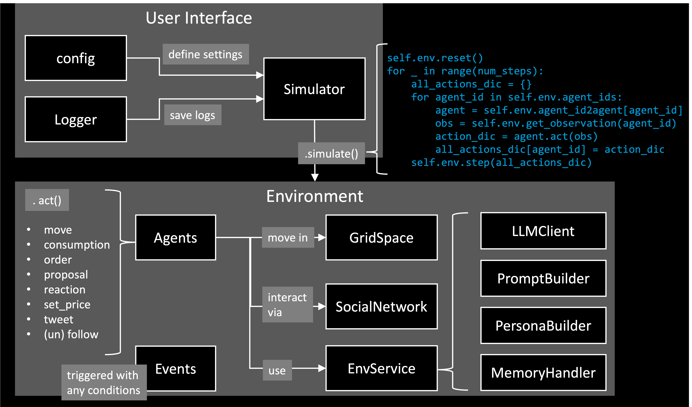

[](https://github.com/psf/black)

<p align="center">
  
  
</p>


EconSimulacra is a simulation platform for studying complex socio-economic systems with large language model (LLM) agents. The framework enables researchers and practitioners to simulate:

- household consumption
- firm pricing strategies
- narrative diffusion through social networks
- spatial mobility of agents

By combining agent-based modeling with LLM reasoning, EconSimulacra allows researchers to study emergent macroeconomic phenomena from micro-level behavioral rules.

# Key Features

- 🧠 LLM-driven agents with internal states and reasoning
- 🏙 Spatial grid environments with agent mobility
- 🛒 Market interactions (consumption, pricing)
- 🌐 Social network dynamics (follow, unfollow, narrative diffusion)
- 📊 Structured simulation logs for analysis
- ⚡ Parallel simulation execution
- 🧩 Modular architecture for extensibility

# Conceptual Architecture

EconSimulacra consists of the following main components:

<p align="center">
  
</p>

## [**Simulator**](https://github.com/SimulacraBusiness/econsimulacra/blob/main/src/econsimulacra/simulator.py) 

The **Simulator** executes the simulation, manages temporal progression, and supports parallel execution. At each simulation step, the simulator collects actions from all agents based on their observations and applies them to the environment. The core logic of the simulator is conceptually as follows.

```python
num_steps: int
for _ in range(num_steps):
    all_actions_dic = {}
    for agent_id in env.agent_ids:
        agent = self.env.agent_id2agent[agent_id]
        obs = self.env.get_observations(agent_id=agent_id)
        action_dic = agent.act(obs)
        all_actions_dic[agent_id] = action_dic
    self.env.step(all_actions_dic)
```

In each step:
1. The environment provides observations to each agent ```env.get_observations(agent_id=agent_id)```
2. Agents decide their actions based on these observations ```action_dic = agent.act(obs)```
3. The environment updates the global state according to the agents' actions. ```env.step(all_actions_dic)```

The Simulator requires ```config``` to apply your simulation settings. See [examples/openai/config.json](https://github.com/SimulacraBusiness/econsimulacra/blob/main/examples/openai/config.json) for an example.

```Python
simulator = Simulator(
    config=config_dic_path,
    env_class=Environment,
    logger=logger,
    summarizer_class=SimulationSummarizer,
)
```

You can introduce your custom classes in your simulation by specifying ```"type": "MyClass"``` in the config and register them to the Simulator. [examples/openai/main.py](https://github.com/SimulacraBusiness/econsimulacra/blob/main/examples/openai/main.py) provides an example to introduce the custom event ```SubsidyEvent```.

```python
simulator.register_classes([MyClass1, MyClass2])
```


## [**Environment**](https://github.com/SimulacraBusiness/econsimulacra/blob/main/src/econsimulacra/envs/base.py)

The **Environment** manages the global state of the simulated world, including the internal states of all agents. It is responsible for:

- providing observations to agents (```.get_observations```)
- applying agents’ actions and updating the world state (```.step```)

The environment includes multiple submodules, such as:

- [**GridSpace**](https://github.com/SimulacraBusiness/econsimulacra/blob/main/src/econsimulacra/envs/space.py): A spatial environment in which agents reside and move. This allows the simulation of spatial interactions, mobility, and location-dependent behaviors.
- [**SocialNetwork**](https://github.com/SimulacraBusiness/econsimulacra/blob/main/src/econsimulacra/envs/social_networks/base.py): A communication layer where agents can exchange messages and interact socially, enabling the study of information diffusion and social influence. The social network also includes a customizable [**RecommenderSystem**](https://github.com/SimulacraBusiness/econsimulacra/blob/main/src/econsimulacra/envs/social_networks/recsys.py) that can suggest other agents to follow.

## [**Agent**](https://github.com/SimulacraBusiness/econsimulacra/blob/main/src/econsimulacra/agents/base.py)

An **Agent** represents an autonomous decision-maker in the simulation Agents receive structured observations from the environment and determine their actions (```.act```). 

The information available to each agent, both as observations received from the environment and as information disclosed to other agents, is fully configurable via the agent configuration. For example, ```requestObs``` field defines what an agent can perceive from the environment, while ```provideInfo*``` fields define what an agent reveals to others.

EconSimulacra provides a built-in [**LLMAgent**](https://github.com/SimulacraBusiness/econsimulacra/blob/main/src/econsimulacra/agents/llm_agent.py) implementation that leverages LLMs to generate agent behaviors. To ensure reliable and stable simulations, agent actions are generated as structured outputs using [Outlines](https://pypi.org/project/outlines/0.1.11/), which enforces predefined schemas for the generated actions.

The LLM-based agent system is modular and consists of several customizable submodules:

- [**LLMClient**](https://github.com/SimulacraBusiness/econsimulacra/blob/main/src/econsimulacra/llm_services/clients/base.py) – manages the underlying language model and inference settings
- [**PersonaBuilder**](https://github.com/SimulacraBusiness/econsimulacra/blob/main/src/econsimulacra/llm_services/personas/base.py) – assigns role-playing personas to agents
- [**PromptBuilder**](https://github.com/SimulacraBusiness/econsimulacra/blob/main/src/econsimulacra/llm_services/prompts/base.py) – constructs prompts used for agent reasoning
- [**MemoryHandler**](https://github.com/SimulacraBusiness/econsimulacra/blob/main/src/econsimulacra/envs/memory.py) - stores and provides each agent the sequence of their experience in the past time steps as memory

By customizing these components, users can easily modify LLM configurations and experiment with different prompting strategies, personas, and model backends without changing the core simulation logic.

## [**Event**](https://github.com/SimulacraBusiness/econsimulacra/blob/main/src/econsimulacra/envss/event.py)

An **EventManager** is responsible for managing events and triggering them at appropriate times during the simulation. Events can be scheduled based on:

- specific timestamps, (```at```)
- time intervals or durations, (```between```)
- periodic execution (e.g., every k steps), (```every```)
- or the occurrence of specific logs (e.g., when a transaction is generated). (```with```)

You can also adapt probabilistic triggering via ```probability```. By registering custom events, users can introduce exogenous dynamics into the simulation, such as policy interventions or regime shifts, in a flexible and extensible manner.

# Basic Usage

## OpenAI API

This section explains how to run EconSimulacra using the [OpenAI API](https://openai.com/index/openai-api/), based on the example in ```examples/openai```.

### 1. Set OpenAI API Key

You need to provide your OpenAI API key in one of the following ways:

**Option A: Environment Variable (recommended)**

```bash
export OPENAI_API_KEY="your_api_key"
```

**Option B: ```config.json```**

```json
{
    "llmClient": {
        "type": "OpenAIClient",
        "modelName": "gpt-4o-mini",
        "apiKey": "your_api_key",
        ...
    },
}
```

### 2. Configure Simulation

An example configuration is provided at: ```config.json```. This file defines simulation parameters (e.g., number of steps), environment settings (e.g., agents, items, space) and LLM-related services (e.g., llm client, prompt settings). You can modify this file to design your own simulation scenario.

### 3. Set Log Output Path

To save simulation logs, set the following environment variable:

```bash
export LOG_TXT_PATH="path/to/output_log.txt"
```

### 4. Run Simulation

Move to the example directory and execute:

```python
cd examples/openai
python main.py
```

In this script, custom ```Event``` class: ```SubsidyEvent``` is implemented. The script will 1) load ```config.json```, 2) generate simulator and register the ```SubsidyEvent``` to the simulator, 3) reset the environment and run the simulation loop, and 4) output logs to the specified path.
